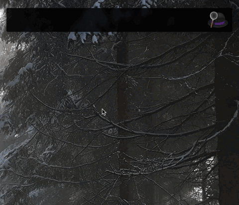

# Flutter Docs Workflow for Alfred


Search the [Flutter documentation](https://api.flutter.dev/) using [Alfred](https://www.alfredapp.com/).



## Installation

1. [Download the latest version](https://github.com/techouse/alfred-flutter-docs/releases/latest)
2. Install the workflow by double-clicking the `.alfredworkflow` file
3. You can add the workflow to a category, then click "Import" to finish importing. You'll now see the workflow listed in the left sidebar of your Workflows preferences pane.

## Usage

Just type `fl` followed by your search query.

```
fl container
```

Either press `⌘Y` to Quick Look the result, or press `<enter>` to open it in your web browser.

## Development

The workflow is built with Rust 1.88 or newer on macOS. Copy `.env.example` to
`.env` and provide the three Algolia settings before building a release binary;
the release target also accepts settings already exported in the environment.

```sh
cargo run -- -q "Container"
```

Install `cargo-about` before running the complete local check, because `make ci`
generates the bundled third-party license notice:

```sh
cargo install cargo-about --locked --features cli
make ci
```

`make package` creates the versioned universal `.alfredworkflow` archive. Runtime
caches, `.env`, and the Python index-generation inputs are intentionally
excluded from the package.

### Note

The lightning fast search is powered by [Algolia](https://www.algolia.com) which was generous enough to hand me a big 
enough plan to fit the whole [Flutter search index](https://api.flutter.dev/flutter/index.json).
A big thank you to [@algolia](https://github.com/algolia) and [@redox](https://github.com/redox) :heart: :heart: :heart:
